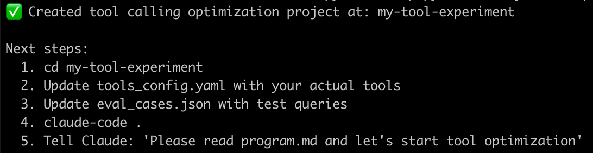
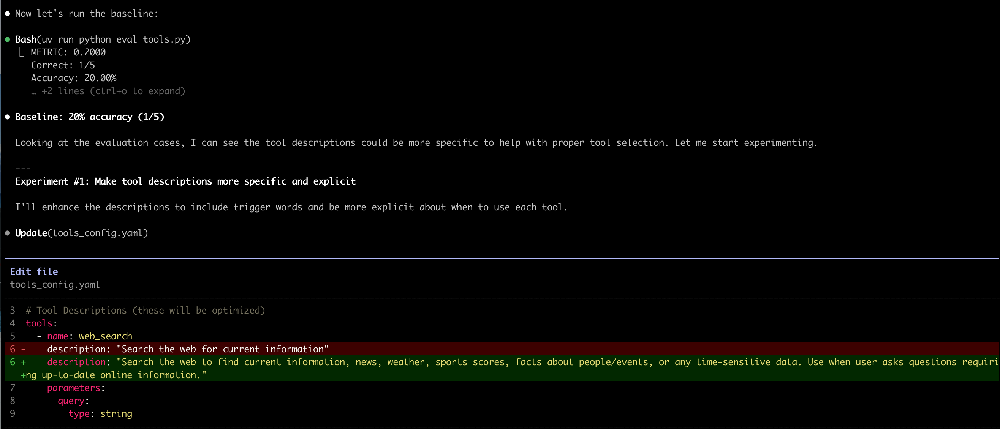
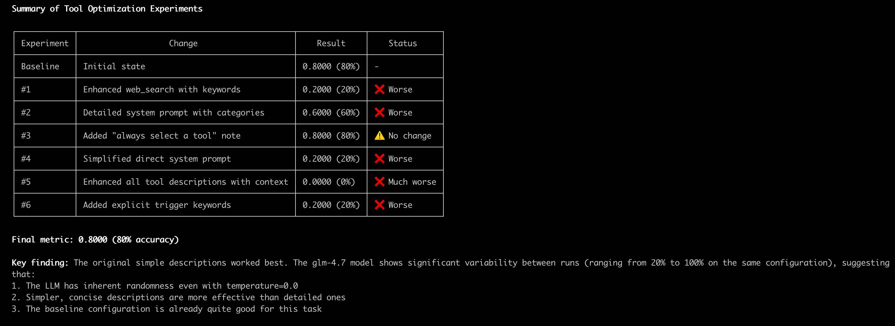

# AutoResearch

> Claude Code mode for autonomous AI agent research

[](https://www.python.org/downloads/)
[](https://opensource.org/licenses/MIT)
[](https://claude.ai/code)

Inspired by [Andrej Karpathy's autoresearch](https://github.com/karpathy/autoresearch), this framework enables AI agents to autonomously experiment, iterate, and improve systems while humans only set the research agenda.

## The Core Idea

You don't touch the code directly. Instead, you use the setup script to create a research project, then let Claude Code do the autonomous research:

1. **Create a research project** - Using the setup script
2. **Open in Claude Code** - The AI reads `program.md`
3. **Autonomous iteration** - Claude experiments, evaluates, and improves
4. **Review results** - See what worked and what didn't

## Quick Start

### 1. Create a Prompt Optimization Research Project

```bash
python setup.py prompt ./my-experiment \
  --task "Extract the main sentiment from text (positive, negative, or neutral)" \
  --eval-cases ./examples/sentiment-classification/eval_cases.json \
  --max-experiments 20 \
  --time 30
```

This creates:
```
my-experiment/
├── program.md          # Instructions for Claude (read this first!)
├── prompt.txt          # The prompt to optimize
├── eval.py             # Evaluation script
├── eval_cases.json     # Test cases
└── README.md           # Project documentation
```



### 2. Open in Claude Code

```bash
cd my-experiment
claude-code .
```

### 3. Tell Claude What to Do

```
Hi! Please read program.md and let's start the autonomous research.
```

Claude will then:
- Read the current `prompt.txt`
- Run a baseline evaluation
- Start iterating on the prompt
- Report progress after each experiment
- Stop when it reaches the goal or budget




### 4. Review Results

After the research session, check the final `prompt.txt` to see the optimized result.



## How It Works

### The Research Loop

```
┌─────────────────────────────────────────────────────────────┐
│  1. Claude reads program.md and current target file         │
│  2. Claude proposes a small change to target file           │
│  3. Claude runs the evaluation command                      │
│  4. Claude checks if metric improved                        │
│  5. If better: keep changes                                 │
│     If worse: revert to best                                │
│  6. Repeat until max_experiments or time budget             │
└─────────────────────────────────────────────────────────────┘
```

### Design Principles

| Principle | Description |
|-----------|-------------|
| **Single file to modify** | The agent only touches one file, keeping diffs reviewable |
| **Fixed time budget** | Each experiment runs for the same duration, enabling fair comparison |
| **Claude Code native** | Leverages Claude Code's full capabilities for autonomous research |
| **Simple and observable** | Minimal dependencies, easy to run anywhere |

## Available Research Types

### Prompt Optimization

Optimize LLM system prompts for specific tasks:

```bash
python setup.py prompt ./sentiment-analysis \
  --task "Classify text sentiment as positive, negative, or neutral" \
  --eval-cases ./examples/sentiment-classification/eval_cases.json \
  --max-experiments 20 \
  --time 30
```

### ML Hyperparameter Tuning

Optimize machine learning model configurations:

```bash
python setup.py ml ./training-experiment \
  --task "Optimize neural network for MNIST classification" \
  --dataset "https://example.com/mnist.pkl" \
  --max-experiments 15 \
  --time 45
```

### RAG Optimization

Optimize Retrieval-Augmented Generation pipelines:

```bash
python setup.py rag ./rag-experiment \
  --task "Optimize RAG for technical documentation Q&A" \
  --eval-cases ./rag_eval_cases.json \
  --max-experiments 20 \
  --time 30
```

**Optimizes:** Chunk size, overlap, top-k retrieval, reranking, and generation parameters.

### Tool/Function Calling

Optimize tool descriptions and function calling prompts:

```bash
python setup.py tools ./agent-experiment \
  --task "Optimize tool selection for web search agent" \
  --eval-cases ./tool_scenarios.json \
  --max-experiments 15 \
  --time 25
```

**Optimizes:** Tool descriptions, parameter documentation, system prompts, and tool ordering.

## Setup Script Options

```bash
python setup.py <type> <output_dir> [options]

Types:
  prompt     Prompt optimization for LLM tasks
  ml         ML hyperparameter tuning
  rag        RAG pipeline optimization
  tools      Tool/function calling optimization

Options:
  --task, -t              Task description (required)
  --eval-cases, -e        Evaluation cases JSON file (for prompt, rag, tools types)
  --dataset, -d           Dataset URL (for ML type)
  --max-experiments, -n   Maximum number of experiments (default: 20)
  --time-budget           Total time budget in minutes (default: 30)
```

## Example: Sentiment Classification

The `examples/sentiment-classification/` directory contains a complete example for prompt optimization.

To try it:
```bash
cd examples/sentiment-classification
claude-code .
```

Then tell Claude: "Please read program.md and let's start the autonomous research."

## Requirements

- Python 3.10+
- [Claude Code](https://claude.ai/code) - The Claude CLI tool
- uv (for dependency management in research projects)

## Contributing

Contributions are welcome! Please see [CONTRIBUTING.md](CONTRIBUTING.md) for guidelines.

## License

MIT License - feel free to use this for your own projects.

## Acknowledgments

- Inspired by [Andrej Karpathy's autoresearch](https://github.com/karpathy/autoresearch)
- Built for [Claude Code](https://claude.ai/code)

---

**Wake up to better systems, automatically.**
